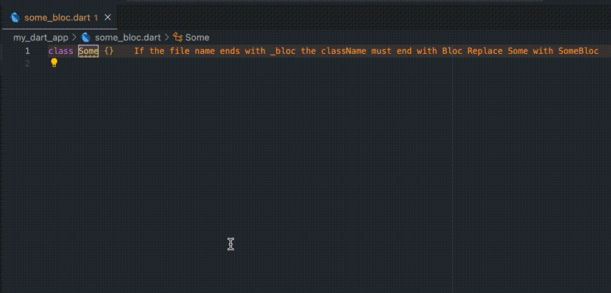

# mason_custom_lint

[](https://github.com/felangel/mason)

This project uses a brick template to generate custom lints with mason.

**Check this brick out on [brickHub](https://brickhub.dev/bricks/custom_lint_brick/0.1.0+1)**



Generated code is built on top of [custom_lint](https://pub.dev/packages/custom_lint#creating-a-custom-lint-package).

## Generate 💻

Take a look at how to initialize [mason](https://github.com/felangel/mason) and then you can do `mason make custom_lint_brick` into a terminal.

CLI will ask you what kind of file name and corresponding classes you want to match. 

E.g. if you have a file called `authentication_service.dart` and you want to have inside it a class called `AuthenticationService` and not only `Authentication` you can write `service` when CLI will ask you.

The same with `bloc`, `model` and so on.

*mason_custom_lints folder contains a generated package that checks for `_service` and `_bloc` files.*

## Usage 🔨

Mason will generate a flutter package based on `custom_lint` package so the only thing you need to do to use it in your project is to add it to pubpsec and change the analysis_options file.

In your App add this to your pubspec.yaml:
```yaml
dev_dependencies:
  custom_lint: ^0.0.15
  mason_custom_lints:
    path: ../mason_custom_lints
```
And in your analysis_options.yaml add:
```yaml
analyzer:
  plugins:
    - custom_lint
```